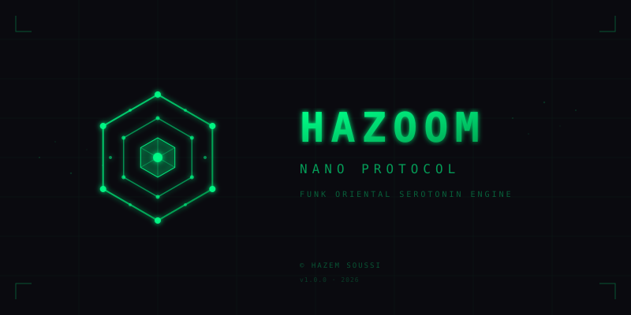

<p align="center">
  
</p>

<h1 align="center">NANO PROTOCOL</h1>
<h3 align="center">Getting Started Guide</h3>

<p align="center">
  <em>Complete setup and usage instructions</em>
</p>

---

## Table of Contents

1. [Prerequisites](#prerequisites)
2. [Installation](#installation)
3. [Running the Web App](#running-the-web-app)
4. [Running the Research Scraper](#running-the-research-scraper)
5. [Using the API](#using-the-api)
6. [Project Structure](#project-structure)
7. [Troubleshooting](#troubleshooting)

---

## Prerequisites

### System Requirements

- **Operating System**: Linux, macOS, or Windows
- **Python**: 3.9 or higher
- **Node.js**: 16+ (optional, for development)
- **RAM**: 4GB minimum, 8GB recommended
- **Storage**: 1GB free space

### Required Software

```bash
# Check Python version
python3 --version

# Check pip
pip3 --version

# Check git
git --version
```

---

## Installation

### 1. Clone the Repository

```bash
# Clone the repository
git clone https://github.com/hazem-soussi-HA/nano-protocol.git

# Navigate to project directory
cd nano-protocol
```

### 2. Set Up Python Environment

```bash
# Create virtual environment
python3 -m venv venv

# Activate virtual environment
# On Linux/macOS:
source venv/bin/activate

# On Windows:
# venv\Scripts\activate

# Upgrade pip
pip install --upgrade pip
```

### 3. Install Dependencies

```bash
# Install main dependencies (for web app)
pip install -r requirements.txt

# Install microservice dependencies
cd microservices/frequency-research-scraper
pip install -r requirements.txt
cd ../..
```

---

## Running the Web App

The web app is the main interface for the frequency healing experience.

### Quick Start

```bash
# Simply open index.html in your browser
open index.html

# Or use a local server (recommended)
python3 -m http.server 8080

# Then visit: http://localhost:8080
```

### Using with Live Server (VS Code)

1. Install "Live Server" extension in VS Code
2. Right-click on `index.html`
3. Select "Open with Live Server"

### Web App Features

- **4 Therapeutic Modules**: Restore, Abundance, Opportunity, Peace
- **Real-time Audio Synthesis**: No audio files needed
- **Visual Meditation**: 4 visualization modes
- **Binaural Beats**: Stereo frequency separation
- **Session Timer**: 5-30 minute sessions

---

## Running the Research Scraper

The research scraper collects frequency healing research from academic papers, books, and web sources.

### Start the API Server

```bash
cd microservices/frequency-research-scraper

# Install dependencies (if not done)
pip install -r requirements.txt

# Start the API server
uvicorn src.api.main:app --host 0.0.0.0 --port 8099 --reload
```

### Run a Full Scrape

```bash
# From the microservice directory
python main.py
```

This will:
1. Scrape PubMed and arXiv for frequency research papers
2. Parse books in the `data/books/` directory
3. Scrape web articles from known sources
4. Process and analyze all data
5. Save results to `data/processed/frequency_research.json`

### Add Your Own Books

Place PDF, EPUB, or TXT files in:

```
microservices/frequency-research-scraper/data/books/
```

The scraper will automatically parse them.

---

## Using the API

Once the API server is running, you can interact with it via HTTP requests.

### API Documentation

- **Swagger UI**: http://localhost:8099/docs
- **ReDoc**: http://localhost:8099/redoc

### Example Requests

#### Get All Research

```bash
curl http://localhost:8099/api/query
```

#### Search by Frequency

```bash
# Find research about 528Hz
curl "http://localhost:8099/api/query?frequency=528"
```

#### Search by Effect

```bash
# Find research about serotonin
curl "http://localhost:8099/api/query?effect=serotonin"
```

#### Filter by Source

```bash
# Only academic papers
curl "http://localhost:8099/api/query?source_type=academic"
```

#### Get Frequency Profile

```bash
# Detailed profile for a specific frequency
curl http://localhost:8099/api/frequency/528
```

#### Get Effect Research

```bash
# Research about a specific effect
curl http://localhost:8099/api/effect/healing
```

#### Free Text Search

```bash
curl "http://localhost:8099/api/search?q=solfeggio+frequency"
```

#### Get Statistics

```bash
curl http://localhost:8099/api/stats
```

#### Get Solfeggio Guide

```bash
curl http://localhost:8099/api/solfeggio
```

#### Start Scraping Job

```bash
curl -X POST http://localhost:8099/api/scrape \
  -H "Content-Type: application/json" \
  -d '{"sources": ["academic", "web"], "max_results": 50}'
```

---

## Project Structure

```
nano-protocol/
│
├── index.html                 # Main web app
├── dimensional.html           # Dimensional explorer
├── logo-preview.html          # Logo preview
│
├── css/
│   └── main.css              # Design system
│
├── js/
│   ├── app.js                # Main application logic
│   ├── audio-engine.js       # Audio synthesis engine
│   └── visualizer.js         # Canvas visualizations
│
├── modules/
│   ├── restore.html          # Healing module
│   ├── abundance.html        # Prosperity module
│   ├── opportunity.html      # Intuition module
│   └── peace.html            # Calm module
│
├── assets/
│   └── hazoom-logo.svg       # Project logo
│
├── microservices/
│   └── frequency-research-scraper/
│       ├── main.py           # Scraper entry point
│       ├── requirements.txt  # Python dependencies
│       ├── README.md         # Microservice docs
│       ├── config/
│       │   └── settings.py   # Configuration
│       ├── src/
│       │   ├── scraper_engine.py
│       │   ├── scrapers/
│       │   │   ├── academic.py
│       │   │   ├── books.py
│       │   │   └── web.py
│       │   ├── pipeline/
│       │   │   └── analyzer.py
│       │   └── api/
│       │       └── main.py
│       └── data/
│           ├── raw/
│           ├── processed/
│           └── books/
│
├── docs/
│   └── getting-started/      # This documentation
│
├── LICENSE                   # MIT License
└── README.md                 # Main project docs
```

---

## Frequency Reference

### Solfeggio Frequencies

| Hz | Name | Use Case |
|----|------|----------|
| 174 | Foundation | Pain relief, grounding |
| 285 | Repair | Tissue healing, energy |
| 396 | Liberation | Release fear, guilt |
| 417 | Change | Transform situations |
| 432 | Harmony | Natural resonance |
| 528 | Transformation | DNA repair, miracles |
| 639 | Connection | Relationships, unity |
| 741 | Intuition | Awakening, expression |
| 852 | Spiritual Order | Third eye, clarity |
| 963 | Divine | Higher consciousness |

### Brainwave Entrainment

| Band | Range | State | Use |
|------|-------|-------|-----|
| Delta | 0.5-4 Hz | Deep sleep | Healing |
| Theta | 4-8 Hz | Meditation | Peace |
| Alpha | 8-14 Hz | Relaxation | Calm |
| Beta | 14-30 Hz | Focus | Opportunity |
| Gamma | 30-100 Hz | Higher self | Abundance |

---

## Usage Guide

### Choosing a Module

| If you need... | Choose Module | Frequencies |
|----------------|---------------|-------------|
| Healing from trauma | RESTORE | 396, 417, 528 Hz |
| Financial abundance | ABUNDANCE | 888, 639, 528 Hz |
| Attracting opportunities | OPPORTUNITY | 741, 852, 963 Hz |
| Inner peace | PEACE | 432, 528, 639 Hz |

### Session Tips

1. **Use headphones** for best binaural beat effect
2. **Start with 15 minutes** and increase gradually
3. **Close your eyes** or focus on the visualization
4. **Breathe deeply** throughout the session
5. **Be consistent** - daily practice yields best results

### Recommended Sessions

| Time of Day | Module | Duration |
|-------------|--------|----------|
| Morning | ABUNDANCE | 20 min |
| Afternoon | OPPORTUNITY | 15 min |
| Evening | PEACE | 20 min |
| Before sleep | RESTORE | 30 min |

---

## Troubleshooting

### Common Issues

#### "Module not found" error

```bash
# Make sure you're in the project directory
cd nano-protocol

# Install dependencies
pip install -r requirements.txt
```

#### API server won't start

```bash
# Check if port 8099 is in use
lsof -i :8099

# Kill existing process if needed
kill -9 <PID>

# Try a different port
uvicorn src.api.main:app --port 8100
```

#### Audio not playing

- Ensure your browser supports Web Audio API
- Check browser volume settings
- Try a different browser (Chrome recommended)

#### Scraper fails

```bash
# Check internet connection
ping google.com

# Verify API keys (if using)
export PUBMED_API_KEY="your_key_here"
```

### Getting Help

- **GitHub Issues**: https://github.com/hazem-soussi-HA/nano-protocol/issues
- **Documentation**: See README.md files in each directory

---

## Quick Reference Commands

```bash
# Clone and setup
git clone https://github.com/hazem-soussi-HA/nano-protocol.git
cd nano-protocol
python3 -m venv venv
source venv/bin/activate
pip install -r requirements.txt

# Run web app
python3 -m http.server 8080

# Run research scraper API
cd microservices/frequency-research-scraper
uvicorn src.api.main:app --port 8099

# Run full scrape
python main.py
```

---

## Next Steps

1. **Explore the Web App**: Try each module with headphones
2. **Run the Scraper**: Collect frequency research data
3. **Query the API**: Find research for specific frequencies
4. **Contribute**: Add books, papers, or code improvements
5. **Share**: Help others discover frequency healing

---

**Researcher**: Hazem Soussi
**Project**: NANO Protocol
**License**: MIT

---

<p align="center">
  <sub>"Healing through sacred frequency." — NANO Protocol</sub>
</p>
